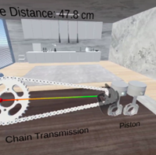
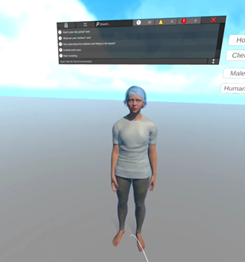

<!DOCTYPE html>
<html lang="en">
<head>
  <meta charset="UTF-8">
  <meta name="viewport" content="width=device-width, initial-scale=1.0">
  <title>VR Portfolio - Javed</title>
  
</head>
<body>

  <nav>
    <a href="#portfolio">Portfolio</a>
    <a href="#about">About</a>
    <a href="#contact">Contact</a>
  </nav>

  <h1>Hi, I am Javed</h1>
  
XR Developer – VR/AR Prototyper – AI-driven Robotics

  <h2 id="portfolio">Portfolio</h2>
  

    <!-- Example Project -->
    

      <iframe class="project-video" src="https://www.youtube.com/embed/YOUR_VIDEO_ID" frameborder="0" allowfullscreen></iframe>
      <h3>Interactive Gear Box Assembly</h3>
      

        Step-by-step immersive VR guide for gearbox assembly.  
        Enhances learning, improves efficiency in tasks, and reduces errors in gearbox maintenance.
        
Tech stack: Unity3D, C#, VR Interaction, Physics-based Assembly

      

    

    

      
      <h3>Inspection of Mechanical Components in VR</h3>
      

        Interactive VR environment to compare master and target models in real-time.  
        Missing components are detected and highlighted instantly.
        
Tech stack: Unity3D, VR UI, Real-time Comparison, Physics Colliders

      

    

    

      
      <h3>Real-time Measurement</h3>
      

        Build an immersive VR environment to interact with components and dynamically measure distances and dimensions in real-time.
        
Tech stack: Unity3D, VR Interaction, Measurement Tools

      

    

    

      
      <h3>Smart Non-Player Character (NPC)</h3>
      

        Voice-driven dialogue with intelligent NPCs in VR. Integrates Speech-to-Text (STT), LLM processing, and Text-to-Speech (TTS).
        
Tech stack: Unity3D, HuggingFace, Groq Llama, Speechify

      

    

    

      
      <h3>VR Table Tennis</h3>
      

        Physics-accurate immersive VR table tennis experience.  
        Simulates natural feel, responsiveness, and excitement of real-world ping pong.
        
Tech stack: Unity3D, VR Physics, Spatial Audio

      

    

    

      
      <h3>Gorilla vs 100 Men</h3>
      

        Action-packed VR combat game where players control a gorilla against waves of enemies. Features physics-based grabbing and throwing.
        
Tech stack: Unity3D, Physics Hand Interaction, VR Combat

      

    

  

  <h2 id="about">About</h2>
  

    Experienced XR Developer specializing in Unity, C#, and AI-driven robotics.  
    Passionate about building immersive VR/AR applications and mentoring XR development.  
    Always eager to expand knowledge and collaborate on innovative projects.
      
    <button class="resume-btn">Download Resume</button>
  

  <h2 id="contact">Contact</h2>
  
Feel free to reach out, I’d love to connect with you! 
  Based in: Chennai, India

  <footer>
    <a href="#">GitHub</a> |
    <a href="#">LinkedIn</a> |
    <a href="mailto:your@email.com">Email</a>
  </footer>

</body>
</html>
